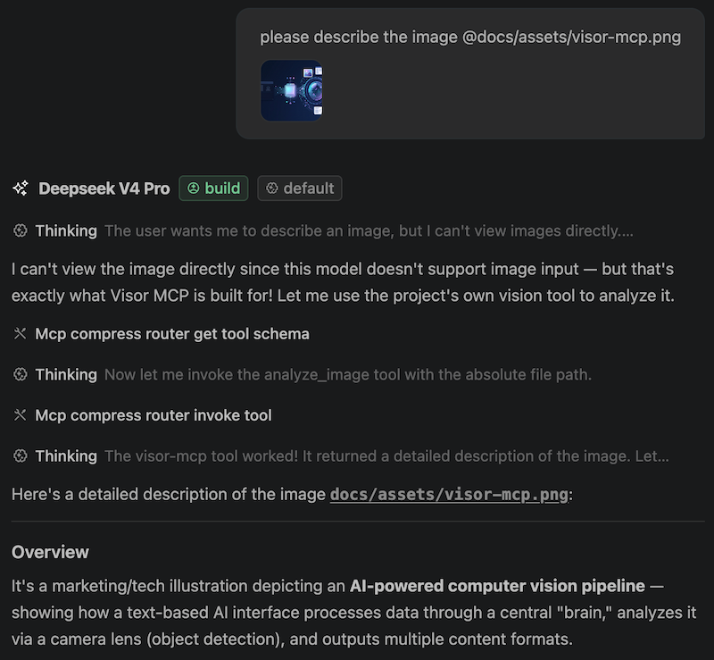

# Visor MCP

[](https://github.com/ameshkov/visor-mcp/actions/workflows/ci.yml)
[](https://www.npmjs.com/package/visor-mcp)
[](https://github.com/ameshkov/visor-mcp/releases)

> MCP server that adds vision capabilities to text-only models through any
> OpenAI-compatible Chat Completions provider.

<p align="center">
  
</p>

## Table of Contents

- [The Problem](#the-problem)
- [The Solution](#the-solution)
- [Quick Start](#quick-start)
- [Tools](#tools)
- [License & Attribution](#license--attribution)

---

## The Problem

Text-only language models cannot see or analyze images. When you share a
screenshot of a UI, an error dialog, a chart, or a diagram with a text-only
model, it cannot extract the visual information. You lose the ability to
ask questions like "what does this error mean?", "convert this design to
code", or "what trends do you see in this chart?".

## The Solution

Visor MCP is an MCP server that bridges this gap. It accepts an image from
your coding agent — a data URL, a local file path, or a remote HTTP URL —
and forwards it to an OpenAI-compatible vision provider. The provider analyzes
the image and returns a text response that flows back to your agent.

You get vision analysis without needing a model with native vision
support. The server handles image loading, format validation, size
limits, retries, timeouts, and cancellation — your agent just calls a
tool and receives the result.

Here's a demonstration of its basic capabilities. Depending on the task the
model can use different tools besides just describing an image: diagnosing error
screenshots, creating code artifacts, comparing two images, and more!



## Quick Start

Pass credentials when adding the server. The server is downloaded on first
use via `npx`. See [Configuration](docs/configuration.md) for all settings,
including optional environment variables and JSON config examples.

### MCP Compress Router

[MCP Compress Router](https://github.com/ameshkov/mcp-compress-router)
compresses all your MCP servers into a single router with just two tools
(`get_tool_schema` and `invoke_tool`), saving up to 99% on token
overhead. It acts as a proxy: instead of every server's full tool
catalog being sent to the LLM on every request, the router exposes a
compact listing and the model fetches schemas on demand.

Register Visor MCP as a downstream server:

```bash
npx mcp-compress-router add visor-mcp \
  --description "Vision analysis tools for screenshots, diagrams, and UI. Use it if you do not understand images natively." \
  -e VISOR_MCP_API_KEY=sk-or-v1-your-key-here \
  -e VISOR_MCP_BASE_URL=https://openrouter.ai/api/v1 \
  -e VISOR_MCP_MODEL=claude-sonnet-5 \
  -- npx -y visor-mcp
```

### OpenCode

**opencode:** add to your `opencode.json` config file. See the
[opencode MCP servers docs](https://opencode.ai/docs/mcp-servers/).

```jsonc
{
  "$schema": "https://opencode.ai/config.json",
  "mcp": {
    "visor-mcp": {
      "type": "local",
      "command": ["npx", "-y", "visor-mcp"],
      "environment": {
        "VISOR_MCP_API_KEY": "sk-or-v1-your-key-here",
        "VISOR_MCP_BASE_URL": "https://openrouter.ai/api/v1",
        "VISOR_MCP_MODEL": "claude-sonnet-5"
      }
    }
  }
}
```

### Claude Code

**Claude Code:** see the
[Claude Code MCP docs](https://code.claude.com/docs/en/mcp).

```bash
claude mcp add visor-mcp \
  --env VISOR_MCP_API_KEY=sk-or-v1-your-key-here \
  --env VISOR_MCP_BASE_URL=https://openrouter.ai/api/v1 \
  --env VISOR_MCP_MODEL=claude-sonnet-5 \
  --transport stdio \
  -- npx -y visor-mcp
```

### Codex

**Codex:** see the
[Codex MCP docs](https://developers.openai.com/codex/mcp).

```bash
codex mcp add visor-mcp \
  --env VISOR_MCP_API_KEY=sk-or-v1-your-key-here \
  --env VISOR_MCP_BASE_URL=https://openrouter.ai/api/v1 \
  --env VISOR_MCP_MODEL=claude-sonnet-5 \
  -- npx -y visor-mcp
```

### Copilot

**GitHub Copilot (VS Code):** add to `.vscode/mcp.json` in your workspace,
or to your user-level MCP settings (Command Palette → `MCP: Open User
Configuration`). See the
[VS Code MCP docs](https://code.visualstudio.com/docs/agent-customization/mcp-servers).

```json
{
  "servers": {
    "visor-mcp": {
      "command": "npx",
      "args": ["-y", "visor-mcp"],
      "env": {
        "VISOR_MCP_API_KEY": "sk-or-v1-your-key-here",
        "VISOR_MCP_BASE_URL": "https://openrouter.ai/api/v1",
        "VISOR_MCP_MODEL": "claude-sonnet-5"
      }
    }
  }
}
```

## Tools

The server exposes seven tools. For detailed reference — including
parameter descriptions, output types, accepted image sources, and
supported formats — see [Tools documentation](docs/tools.md).

| Tool | Purpose | Fields |
| --- | --- | --- |
| `ui_diff_check` | Compare an expected UI screenshot with an actual implementation to find visual discrepancies. | `expected_image_source`, `actual_image_source`, `prompt` |
| `ui_to_artifact` | Convert a UI screenshot into frontend code, an AI recreation prompt, a design specification, or a natural-language description. | `image_source`, `output_type` (one of `code`, `prompt`, `spec`, `description`), `prompt` |
| `extract_text_from_screenshot` | Transcribe text from screenshots of source code, terminal output, configuration, or prose. | `image_source`, `prompt`, `programming_language` (optional) |
| `diagnose_error_screenshot` | Analyze a screenshot containing an error, exception, or stack trace for diagnosis. | `image_source`, `prompt`, `context` (optional) |
| `understand_technical_diagram` | Explain architecture diagrams, flowcharts, UML, entity-relationship, and sequence diagrams. | `image_source`, `prompt`, `diagram_type` (optional) |
| `analyze_image` | General-purpose image analysis; the fallback for requests not covered by a specialized tool. | `image_source`, `prompt` |
| `analyze_data_visualization` | Analyze charts, graphs, and dashboards for metrics, patterns, and insights. | `image_source`, `prompt`, `analysis_focus` (optional) |

## License & Attribution

MIT. Behavioral compatibility derives from `@z_ai/mcp-server` (Apache-2.0),
without implying Z.AI endorsement.

---

## Documentation

- [Configuration](docs/configuration.md) — environment variables, JSON config, global install, build from source
- [Tools](docs/tools.md) — detailed reference with image source and format rules
- [Development](DEVELOPMENT.md) — how to set up and contribute
- [LLM agent rules](AGENTS.md) — AI-assisted development guidelines
- [Changelog](CHANGELOG.md) — version history
